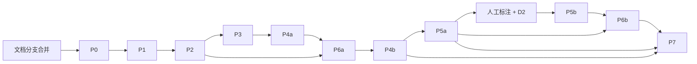

# FTSM 升级实施规格（总纲）

本文是升级规格的总纲：全局事实、阶段依赖、各类登记表、Coverage Matrix 和未验证事项清单。

- 每个阶段的**完整执行包**：`docs/phases/<阶段>.md`
- 每个阶段可以直接复制给 agent 的 **prompt**：`docs/agent-prompts/<阶段>.md`
- P0 的最终开工 prompt：[`agent-prompts/START-P0.md`](agent-prompts/START-P0.md)
- 设计理由（为什么这样改）：[`UPGRADE_PLAN.md`](UPGRADE_PLAN.md)

本文与 `UPGRADE_PLAN.md` 冲突时，以本文和各阶段执行包为准。

| 阶段 | 执行包 | Agent prompt |
| --- | --- | --- |
| P0 | [phases/P0.md](phases/P0.md) | [agent-prompts/P0.md](agent-prompts/P0.md) |
| P1 | [phases/P1.md](phases/P1.md) | [agent-prompts/P1.md](agent-prompts/P1.md) |
| P2 | [phases/P2.md](phases/P2.md) | [agent-prompts/P2.md](agent-prompts/P2.md) |
| P3 | [phases/P3.md](phases/P3.md) | [agent-prompts/P3.md](agent-prompts/P3.md) |
| P4a | [phases/P4a.md](phases/P4a.md) | [agent-prompts/P4a.md](agent-prompts/P4a.md) |
| P6a | [phases/P6a.md](phases/P6a.md) | [agent-prompts/P6a.md](agent-prompts/P6a.md) |
| P4b | [phases/P4b.md](phases/P4b.md) | [agent-prompts/P4b.md](agent-prompts/P4b.md) |
| P5a | [phases/P5a.md](phases/P5a.md) | [agent-prompts/P5a.md](agent-prompts/P5a.md) |
| P5b | [phases/P5b.md](phases/P5b.md) | [agent-prompts/P5b.md](agent-prompts/P5b.md) |
| P6b | [phases/P6b.md](phases/P6b.md) | [agent-prompts/P6b.md](agent-prompts/P6b.md) |
| P7 | [phases/P7.md](phases/P7.md) | [agent-prompts/P7.md](agent-prompts/P7.md) |

---

## 0. 全局

### 0.1 仓库事实（2026-10-03 核实）

| 事实 | 值 | 依据 |
| --- | --- | --- |
| `origin/main` 的 HEAD | `5f5fae4e6c132d90591471046b91806766d1a8c6`，对应 v0.4.2 | `git log` |
| v0.4.0 / v0.4.1 对应的提交 | `30ece89` / `e1321ff`（仅供参考） | `git log` |
| v0.4.3–v0.4.6 | 只在文档分支 `claude/inspiring-dijkstra-unfko2` 上，**没有合并到 main** | `git log origin/main` |
| v0.4.3 的性质 | 文档加上 `docker-compose.yml` 中 `LLM_*` 的修复，**不是纯文档变更** | diff |
| 远端 tag | 无 | `git ls-remote --tags origin` |
| 构建 | `backend/pom.xml`：Boot 3.3.5、Java 17、Lombok 覆盖为 1.18.36、springdoc 2.6.0；没有 Maven Wrapper；根目录没有 pom | 源码 |
| 测试 | 5 个（3 个类）。在 `5f5fae4` 上用 JDK 21.0.11 和 Maven 3.9.11 执行 `mvn -B verify` 全部通过 | **[实验]** |
| Schema | Hibernate `ddl-auto: update`；6 张表；没有迁移工具 | 源码 |
| 秒杀 | Lua 扣减后 `XADD` 到 Stream；拒绝时返回 200；消费者每 500 ms 轮询，用 FAKE_WALLET 结算 | 源码 |
| 助手 | WebClient 直接调 DeepSeek；没有工具调用；`ChatbotController` 阻塞等待结果 | 源码 |
| Compose | 使用浮动 tag；端口写死；`main` 上仍然在传 `GEMINI_*` | 源码 |

### 0.2 证据标记

| 标记 | 含义 |
| --- | --- |
| **[实验]** | 在仓库外的临时目录中实际编译或运行过（2026-10-03）。实验代码不在仓库里 |
| **[源码]** | 从源码、jar 中的类或字符串、Maven Central 或 Docker Hub 的元数据、官方 Release 文件中确认 |
| **[未验证]** | 推断得出；由对应阶段的指定验收项来证明（见 §3） |

下载文件或确认版本存在，都**不算**编译或运行成功。

### 0.3 阶段顺序、版本号与依赖



| 阶段 | 版本 | 必须已合并的前置阶段 | 人工条件 |
| --- | --- | --- | --- |
| P0 | v0.5.0 | 文档分支（v0.4.3–v0.4.6） | 无 |
| P1 | v0.6.0 | P0 | **D1** |
| P2 | v0.7.0 | P1 | 无（只有在生产切换时需要人执行 §10.1 的清单） |
| P3 | v0.7.1 | P2 | 正式测量由人在固定机器上进行（不阻塞 PR） |
| P4a | v0.8.0 | P2、P3 | 无 |
| P6a | v0.9.0 | P2、P4a | 仓库的 GHCR 写权限（只影响合并后的发布） |
| P4b | v0.10.0 | P4a、P6a | 真实 key 的验收（不阻塞 PR） |
| P5a | v0.11.0 | P4b | 无 |
| P5b | v0.12.0 | P5a | **人工标注 + D2 + 凭据或运行环境** |
| P6b | v0.13.0 | P6a、P4b、P5a | 能运行 kind 的环境 |
| P7 | v0.14.0 | P4b、P5a | **D3**（可选；不实施时不阻塞任何阶段） |

规则：

- P0 的唯一代码入口是已经合并文档分支后的 `main`。在 `origin/main` 同时满足 CHANGELOG 含 v0.4.6、`docs/phases/P0.md` 存在、且文档迁移无冲突之前，agent 不得创建 P0 分支、创建 baseline tag 或修改代码。
- 按上表顺序**串行**执行，一次只开一个阶段的 PR。
- **P2 与 P4a 不能并行**：P4a 会移动 P2 要修改的实体文件。
- P3 中由人进行的正式测量可以与后续阶段并行，单独提交。

### 0.4 Maven 命令的工作目录

| 时期 | 命令 |
| --- | --- |
| P0–P3（P4a 合并之前） | `cd backend && ./mvnw …` |
| P4a 及以后 | 在仓库根目录执行 `./mvnw …`；只构建后端用 `./mvnw -B -pl backend -am -DskipTests package` |

### 0.5 版本基线

| 组件 | 版本 | 依据 |
| --- | --- | --- |
| JDK 运行时镜像 | 固定为 `eclipse-temurin:21.0.12.1_1-jre-noble`（21 LTS；需要升级时先修订规格和证据） | **[源码：Docker Hub]** |
| 构建镜像 | `maven:3.9.11-eclipse-temurin-21-noble` | **[源码]** |
| Maven Wrapper | 3.9.11，`distributionSha256Sum=0d7125e8c91097b36edb990ea5934e6c68b4440eef4ea96510a0f6815e7eeadb`，maven-wrapper-plugin 3.3.4，`only-script` 模式 | **[实验]**：生成和使用都已验证，sha256 与官方 sha512 交叉核对过 |
| Spring Boot | P0：3.3.5；P1 起：3.5.16（3.5 线的最后一个版本，见 D1） | **[源码]** |
| Boot 3.5.16 管理的依赖 | Hibernate 6.6.53.Final、Flyway 11.7.2、Lombok 1.18.46、mysql-connector-j 9.7.0、spring-kafka 3.3.16、kafka-clients 3.9.2、Caffeine 3.2.4、Testcontainers 1.21.4、testcontainers-redis 2.2.4、Awaitility 4.2.2、OpenTelemetry API 1.49.0、Failsafe 3.5.6 | **[源码：spring-boot-dependencies 3.5.16]** |
| springdoc-openapi | 2.8.17（其 parent 为 Boot 3.5.13） | **[源码]** |
| Spring AI BOM | 1.1.8（MCP SDK 0.18.3）；与 Boot 3.5.16 一起能够编译和启动 | **[实验]** |
| Resilience4j | 2.4.0 | **[源码]** |
| ShedLock | 6.10.0（7.x 依赖 Spring 7.0.9，**不能用**） | **[源码]** |
| OTel Java agent | 2.32.0，sha256 `f787eb6c7f3d18e69a431e108a15278d25ee37f83d68b678f621e063f3988f82` | **[实验]**：下载后计算，并核对了 manifest |
| 镜像 | `mysql:8.0.46`、`redis:7.4.6-alpine`（P0–P1）、`redis:8.10.2`（P2 起）、`apache/kafka:3.9.2`、`grafana/otel-lgtm:0.35.0`、`grafana/k6:2.3.0`、`ollama/ollama:0.35.1`、`busybox:1.37.0` | **[源码：Docker Hub 上 tag 存在]** |
| k6 | 2.3.0；sha256 amd64 `39c3117b…a8ab1`、arm64 `5ca3433e…49b90`（全文见 P0 §6.2） | **[实验]**：脚本中的 HS256 签名、阈值、`handleSummary` 都已验证 |
| kind / node 镜像 | v0.33.0（sha256 `aee61515…8e0d`）/ `kindest/node:v1.37.0@sha256:a1ed56cf…80ae5` | **[源码]** |
| kubectl / kubeconform / metrics-server / local-path-provisioner | v1.37.1 / v0.8.0 / v0.9.0 / v0.0.37 | **[源码]** |
| Node / vitest | 20.20.2 / 2.1.9（peerDependency `vite ^5`） | **[源码]** |
| GitHub Actions | `checkout@v4`、`setup-java@v4`、`setup-node@v4`、`upload-artifact@v4`、`setup-buildx-action@v3`、`login-action@v3`、`build-push-action@v6`，runner 为 `ubuntu-24.04` | 固定主版本 |

### 0.6 迁移登记（Flyway `out-of-order=false`）

| 版本 | 文件 | 引入阶段 | 前置要求 |
| --- | --- | --- | --- |
| 1 | `V1__baseline.sql` | P0 | 由导出脚本生成；**合并后永不修改** |
| 1.1 | `V1_1__p1_hibernate66_compat.sql` | P1（**仅当确实需要时**） | 只做 Hibernate 6.6 的兼容修正 |
| 2 | `V2__seckill_outbox.sql` | P2 | 包含历史数据回填 |
| 3 | `V3__catalog_fulltext.sql` | P5a | — |
| 4 | `V4__shedlock.sql` | P6b | 要求 V3 已经合并 |
| 5 | `V5__outbox_traceparent.sql` | P6b | — |

**编号策略**：

- 每个阶段的编号是预先分配好的。按 §0.3 的顺序合并时，编号严格递增。
- 某个阶段需要额外的兼容修正时，只能使用它自己编号范围内的小数版本（例如 `V2_1`），并且必须在下一个阶段合并之前完成。
- **任何**已经合并的迁移都不得修改。
- P3、P4a、P6a、P4b、P5b、P7 都**没有**迁移。

### 0.7 环境变量登记（应用配置；脚本专用的变量见各阶段执行包）

| 变量 | 引入阶段 | 默认值 | 绑定的属性 | 消费者 | compose / K8s |
| --- | --- | --- | --- | --- | --- |
| `MYSQL_HOST_PORT`、`REDIS_HOST_PORT`、`BACKEND_HOST_PORT`、`FRONTEND_HOST_PORT` | P0 | 3306 / 6379 / 8080 / 80 | — | compose 的端口映射 | — |
| `VIRTUAL_THREADS` | P1 | `true` | `spring.threads.virtual.enabled` | backend | compose 的 environment |
| `DB_POOL_SIZE` | P1 | `20` | `spring.datasource.hikari.maximum-pool-size` | backend | 同上 |
| `JAVA_OPTS` | P1 | `-XX:MaxRAMPercentage=75` | Dockerfile 的 ENTRYPOINT | 容器 | 同上 |
| `KAFKA_BOOTSTRAP` | P2 | `localhost:9092` | `spring.kafka.bootstrap-servers` | backend | compose 内为 `kafka:9092`；宿主机为 `127.0.0.1:${KAFKA_HOST_PORT}`；K8s 为 `kafka-0.kafka.ftsm.svc.cluster.local:9092` |
| `KAFKA_REPLICAS` | P2 | `1` | `app.seckill.replicas` | backend | — |
| `KAFKA_HOST_PORT` | P2 | `29092` | — | compose | — |
| `SECKILL_MODE` | P3 | `async` | `app.seckill.mode` | backend | compose |
| `LLM_PROVIDER` | P4b | **`none`** | `spring.ai.model.chat` | backend（EPP） | compose；K8s configmap |
| `LLM_API_KEY` | v0.4.0（已有） | 空 | `spring.ai.deepseek.api-key` | backend | secret |
| `LLM_MODEL` | v0.4.0（已有） | `deepseek-v4-flash` | `spring.ai.deepseek.chat.options.model` | backend | compose |
| `DEEPSEEK_BASE_URL` | P4b（取代 `LLM_BASE_URL`） | `https://api.deepseek.com` | `spring.ai.deepseek.base-url` | backend | compose |
| `MCP_SERVER_URL` | P4b | `http://localhost:8081` | `app.assistant.mcp-url` | backend | compose / K8s 中为 `http://mcp-server:8081` |
| `MCP_CLIENT_ENABLED` | P4b | `true` | `app.assistant.mcp-enabled` | backend | compose |
| `MCP_DB_USERNAME` / `MCP_DB_PASSWORD` | P4b | `ftsm_ro` / 空 | `spring.datasource.username` / `password`（mcp-server） | mcp-server、mysql 的初始化脚本 | compose；secret |
| `MCP_HOST_PORT` | P4b | `18082` | — | compose（只绑定 127.0.0.1） | — |
| `SPRING_PROFILES_ACTIVE` | P4b 起 compose 中改为变量 | `prod` | — | backend | compose |
| `APP_ASSISTANT_FAKEMODEL` | P4b | `false` | `app.assistant.fake-model`（只在 dev 下生效） | backend | compose |
| `APP_DEMO_TARGET_DB`、`APP_DEMO_ALLOW_DEFAULT_DB`、`APP_DEMO_ON_CONFLICT`、`SEED_DEMO_PASSWORD` | P5a | 空 / `false` / `fail` / 空 | `app.demo.*` | backend（demo profile） | compose |
| `EMBEDDING_PROVIDER` | P5b | `none` | `spring.ai.model.embedding` | backend、mcp-server | compose；configmap |
| `OPENAI_API_KEY` | P5b（P7 也会用到） | 空 | `spring.ai.openai.api-key`、`app.vision.api-key` | backend、mcp-server | secret |
| `OPENAI_EMBEDDING_MODEL`、`OLLAMA_BASE_URL`、`OLLAMA_EMBEDDING_MODEL` | P5b | `text-embedding-3-small` / `http://localhost:11434` / `bge-m3` | `spring.ai.openai…`、`spring.ai.ollama…` | 同上 | compose 中 Ollama 为 `http://ollama:11434` |
| `CATALOG_VECTOR_VERSION`、`APP_CATALOG_REINDEX` | P5b | `v1` / `false` | `app.catalog.vector.version`、`app.catalog.reindex` | 同上 | compose |
| `OTLP_METRICS_ENABLED`、`OTLP_METRICS_URL` | P6b | `false` / `http://localhost:4318/v1/metrics` | `management.otlp.metrics.export.*` | backend、mcp-server | compose / K8s 中为 `http://lgtm:4318/v1/metrics` |
| `JAVA_TOOL_OPTIONS`、`OTEL_SERVICE_NAME`、`OTEL_EXPORTER_OTLP_ENDPOINT`、`OTEL_EXPORTER_OTLP_PROTOCOL`、`OTEL_METRICS_EXPORTER`、`OTEL_LOGS_EXPORTER`、`OTEL_INSTRUMENTATION_MICROMETER_ENABLED` | P6b | 不设置 | agent | 容器 | compose / K8s |
| `GRAFANA_HOST_PORT`、`OTLP_HTTP_HOST_PORT` | P6b | 3000 / 4318 | — | compose | — |
| `OPENAI_VISION_MODEL`、`VISION_ENABLED` | P7 | `gpt-4o` / `true` | `app.vision.*` | backend | compose |

compose 的 `--env-file` 只用于 compose 文件里的变量替换，**不会**自动把变量传进容器。所以表中每一个需要进入容器的变量，都必须在对应服务的 `environment` 中显式写出来（各阶段的执行包都列出了要新增的条目）。

### 0.8 通用停止规则

遇到下列情况，agent 必须停止相关步骤并报告，不得绕过：

1. 开始时工作区不干净。不得 stash、reset 或删除。
2. 前置阶段未合并，或者人工条件（D1、D2、D3、标注）未满足。
3. 依赖或工具下载失败，或者 checksum 不匹配。不得换用其他版本，不得关闭校验。
4. Flyway 或 Hibernate 的 validate 失败。不得修改已合并的迁移，不得改回 `update`。
5. 正确性类验收失败（超卖、重复订单、数据丢失）。不得修改断言或阈值。
6. 所需的服务或资源不可用，并且执行包中没有给出替代方式。
7. 发现实际的外部行为与规格中标为 [未验证] 的描述不一致。报告给人，由人决定修改实现还是修改规格。
8. 需要杀掉、删除或修改不属于本阶段创建的进程、容器、数据卷、数据库或集群。

### 0.9 人工决策与已知风险

| 编号 | 事项 | 卡住的阶段 | 默认 / 建议 |
| --- | --- | --- | --- |
| H0 | 合并文档分支 | P0 | — |
| D1 | 是否留在 Boot 3.5.16。证据：3.5 线最后一次发布是 2026-06-25，之后只有 4.0.x / 4.1.x 继续发布，开源支持**很可能已经结束**；本环境无法访问 spring.io 的支持表 | P1 | 规格按 3.5.16 编写。如果改用 Boot 4，需要先单独提一个文档 PR 修订规格（Spring AI 2.0.x、ShedLock 7、Testcontainers 2、Hibernate 7、springdoc 3） |
| D2 | embedding 提供方：openai 还是 ollama | P5b | 有 OpenAI key 就选 openai，没有就选 ollama |
| D3 | 是否实施 P7 | P7 | 可选 |
| L1 | 标注 `eval/queries.jsonl` | P5b | 由人完成，或者至少逐条审核 |
| B1 | 正式压测机器 | P3 的结论 | 物理机或独占的虚拟机，≥ 8 核 |

| 已知风险 | 写入了哪里 |
| --- | --- |
| Boot 3.5 线不再有开源补丁 | P1 §2；D1 |
| P2 中四个可能少卖的窗口（崩溃、无法确认、补偿失败等） | P2 §6.1 的表；由对账发现 |
| DLT 发布失败时会阻塞分区（语义 [未验证]） | P2 §6.1；P6a `DltPublishFailureIT` |
| 会话记忆和工具记录只在单进程内存中 | P4b §6.4；README |
| 上传文件只能在单节点之间共享 | P6b §10 |
| Node 20 已经停止维护（2026-04） | 本表；可以在后续阶段单独评估升级到 Node 22 |
| 正式的性能和检索数字依赖人工步骤 | P3 H1；P5b A9 |

### 0.10 全局约定

| 项 | 约定 |
| --- | --- |
| 分支与 PR | 一个阶段一个 PR，从最新的 `origin/main` 拉分支；分支名见各阶段 prompt |
| 包结构 | 根包为 `my.edu.ukm.ftsm.ecommerce`；新增的子包（`demo`、`search`、`vision`、`observability`、`it`）以执行包为准 |
| 错误 | 统一使用 `BusinessException` 等异常，由 `GlobalExceptionHandler` 转成响应；P7 新增的 `VisionException` 也在这里映射 |
| Redis key | 全部集中在 `RedisKeys` |
| 命令 | 显式指定工作目录；不依赖 `.env`；等待一律使用 `scripts/lib/wait.sh` 中带超时的函数；保留原始退出码；bash 脚本开头写 `set -Eeuo pipefail`，参数用数组传递 |
| 验收环境 | 每个阶段使用独立的 compose 项目（`ftsm-<阶段>-acc`）和独立的端口（§0.11），只清理自己创建的资源 |
| 证据 | 写到 `scripts/<阶段>/evidence/` 或 `loadtest/results/`；命令输出贴进 PR |
| 密钥 | 不得出现在提交、PR、截图和日志里 |
| 文档 | 每个 PR 都要更新 CHANGELOG（使用本阶段的版本号）、HANDOFF 的状态表和 API 列表；README 中有关行为的说明 |

PR 描述模板（各阶段可以增加小节）：

```markdown
## Scope
<阶段> per docs/phases/<阶段>.md
## Environment
OS/arch, JDK, Docker, tool versions actually used
## Acceptance
| ID | Result (pass/fail/not run) | Command | Key output / evidence path |
## Deviations from spec
## External follow-ups (not blocking merge)
```

### 0.11 端口登记（宿主机端口）

| 阶段 | 项目或进程 | MySQL | Redis | Kafka | 后端 | 其他 |
| --- | --- | --- | --- | --- | --- | --- |
| P0 | 临时实例 | 3307 | 6380 | — | 8080、18080（导出用） | H2 验证用 8081 |
| P1 | 临时实例 / `ftsm-p1-acc` | 3307 / 13306 | 6380 / 16379 | — | 8080 / 18080 | 前端 18081 |
| P2 | `ftsm-p2-acc` | 23306 | 26379 | 29092 | 28080 | 前端 28081 |
| P3 | `ftsm-p3-bench` 加上宿主机 JVM | 33306 | 36379 | 39092 | 8080 | — |
| P4a | `ftsm-p4a-acc` | 43306 | 46379 | 49092 | 48080 | — |
| P6a | Testcontainers（随机端口） | — | — | — | — | — |
| P4b | `ftsm-p4b-acc` | 53306 | 56379 | 59092 | 58080 | mcp-server 58082、前端 58081 |
| P5a | `ftsm-p5a-acc` | 63306 | 63379 | 63092 | 63080 | 前端 63081、mcp-server 63082（仅 127.0.0.1） |
| P5b | `ftsm-p5b-acc` | 63406 | 63479 | 63192 | 63180 | mcp-server 63182（仅 127.0.0.1）、Ollama 61434 |
| P6b | `ftsm-p6b-acc` / kind | 64306 | 64379 | 64092 | 64080 | LGTM 64000（Grafana）/ 64318（OTLP HTTP）；kind 8088、3300 |
| P7 | `ftsm-p7-acc` | 23406 | 26479 | 29192 | 28180 | 前端 28181 |

表中所有端口都在 1–65535 之内。各 compose 项目（`ftsm-<阶段>-acc`、`ftsm-p3-bench`）的端口互不重复；重复出现的 3307、6380、8080、18080 只用于临时实例或 P3 的宿主机 JVM，它们不会同时运行。2026-10-06 修正：P5a、P5b、P6b 三行原先有 14 个端口超过 65535，无法绑定；P5a 一行改为实际验收使用的端口（维护者决定），P5b 为 P5a 对应端口加 100，P6b 改用 64xxx。

### 0.12 跨阶段符号登记（谁创建，谁使用）

| 符号或文件 | 创建阶段 | 后续使用或修改的阶段 |
| --- | --- | --- |
| `scripts/lib/wait.sh`（`wait_http`、`wait_cmd`） | P0 | 之后所有阶段 |
| `scripts/db/lib.sh`（`mysql_cli`、`start_backend`、`temp:` 目标） | P0 | P1；P2 增加 `compose:` 目标；P3 让 `start_backend` 支持端口参数；P6b 增加 `k8s:` 目标 |
| `loadtest/run.sh`、`drain.sh`、`summarize.py`、`verify*.sql` | P0 | P2 增加 outbox 模式和 409；P3 增加三种吞吐和 `persist.sql`；P6b 增加 `outbox-k8s` 模式 |
| `scripts/tools/install_k6.sh`、`scripts/db/schema_fingerprint.sh`、`compare_schemas.sh` | P0 | P1–P3 |
| `SeckillOrderWriter`、`SeckillOrderMessage`、`OutboxDao`、`OutboxPublisher` | P2 | P3（sync 模式）、P6a（IT）、P6b（traceparent） |
| `SeckillReconciler`、`OutboxJanitor` | P2 | P6a（IT）、P6b（ShedLock） |
| `loadtest/bench/*` | P3 | P4a（命令改为根目录写法） |
| `catalog-core` 模块 | P4a | P4b、P5a、P5b |
| `TestcontainersConfiguration`、`AbstractIntegrationTest`、`expected-tests.json`、`check_test_reports.py`、`.github/workflows/ci.yml`、`MigrationIT` | P6a | P4b、P5a、P5b、P6b、P7 都会追加 IT 或修改期望版本 |
| `CatalogSearchService`、`SearchDtos`、mcp-server、`ShopTools`、`mcp_probe.py` | P4b | P5a（内部改为调用新实现）、P5b（改用混合检索） |
| `LlmProviderEnvironmentPostProcessor`、`ObjectProvider<ChatModel>` 的装配方式 | P4b | P5b（新增 embedding 守卫）、P5b 的 `LlmReranker` |
| `CatalogCategory`、`KeywordRecall`、`HybridSearchService`、`SearchQuery/SearchResult`、`/api/search`、`catalog.json`、`eval/*` | P5a | P5b、P7（使用 `CatalogCategory`） |
| `CatalogVectorStoreHolder`、`CatalogIndexer`、`CatalogChangedEvent`、`spring.ai.model.*: none` 的设置 | P5b | P6b（对账任务加锁）、P7（同一组设置） |
| `SchedulingLockConfig`、`TraceContextSupport`、`SeckillMetrics` | P6b | — |

---

## 1. Coverage Matrix

✅ 表示执行包中已有完整的内容，后面括号是所在的小节。“未解决项”指依赖外部条件、或者需要在实施时实测的事项（同时见 §3）。

| 阶段 | 前置 | 文件清单 | 实施顺序 | 契约 | 配置/启动 | 自动测试 | 故障验收 | 迁移/恢复 | PR 合并门槛 | agent prompt | 未解决项 |
| --- | --- | --- | --- | --- | --- | --- | --- | --- | --- | --- | --- |
| P0 | ✅ §2 | ✅ §4 | ✅ §5（18 步） | ✅ §6.1–6.9 | ✅ §7 | ✅ §8 | ✅ A4 / A11 / k6 的错误判定 | ✅ §10 | ✅ §11 | ✅ | 方式 L 下 MySQL 的版本以实际安装为准 |
| P1 | ✅ §2（D1） | ✅ | ✅ 11 步 | ✅ 依赖核对、V1_1 策略 | ✅ 容器验收 | ✅ | ✅ 升级路径、虚拟线程开 / 关 | ✅ | ✅ | ✅ | D1；Flyway 10→11 与 Hibernate 6.6 的 validate（A4 / A5） |
| P2 | ✅ | ✅ | ✅ 13 步 | ✅ 事务边界与故障表、消息体、SQL、HTTP | ✅ compose 与 Kafka | ✅ 10 个测试类 | ✅ A6–A11 | ✅ 切换清单 | ✅ | ✅ | DLT 发布失败时的语义（P6a 证明） |
| P3 | ✅ | ✅ | ✅ | ✅ sync 模式、三种吞吐的定义 | ✅ bench 脚本 | ✅ | ✅ 判定一次运行是否有效 | ✅ | ✅（agent 与人工分开） | ✅ | 正式测量（H1，人工） |
| P4a | ✅ | ✅ 新旧路径对照表 | ✅ | ✅ 三个 POM、Docker | ✅ | ✅ 测试数量对比 | 不适用（不改行为） | ✅ | ✅ | ✅ | — |
| P6a | ✅ | ✅ | ✅ | ✅ 隔离规则、11 个 IT、零测试保护、CI | ✅ | ✅ | ✅ 暂停、重启、重放、DLT | ✅ | ✅（PR / 合并后 / 部署分为三级） | ✅ | 容器 bean 随上下文关闭的行为；合并后的发布 |
| P4b | ✅ | ✅ | ✅ | ✅ provider 矩阵、MCP、system 提示、鉴权、SSE | ✅ compose、nginx | ✅ 6 个单元测试 + 4 个 IT + MCP IT + vitest | ✅ MCP 中断、熔断、无 key | ✅ | ✅ | ✅ | E1–E3 需要真实 key；鉴权修复是否需要由 IT 决定 |
| P5a | ✅ | ✅ | ✅ | ✅ 原子导入、DTO、排序、评测指标 | ✅ | ✅ 包括真实 MySQL 的 IT | ✅ 导入冲突与回滚 | ✅ | ✅ | ✅ | 标注（L1） |
| P5b | ✅（L1、D2） | ✅ | ✅ | ✅ 装配矩阵、降级、过滤、版本化、同步 | ✅ | ✅ 包括完整应用的启动 IT | ✅ embedding 失败、乱序、回填并发 | ✅ 切换模型 | ✅ | ✅ | D2；Redis 8 的向量能力（A5）；OpenAI starter 多出来的自动配置 |
| P6b | ✅ | ✅ 包括全部 K8s 清单及其必需字段 | ✅ | ✅ 锁表、探针、trace、指标表 | ✅ kind 完整流程 | ✅ 多实例 IT | ✅ HPA 的判定规则 | ✅ | ✅ | ✅ | 实际的指标名称；kind 默认的 provisioner；kubeconform 的 schema |
| P7 | ✅（D3） | ✅ | ✅ | ✅ DTO、错误码、路径校验、成本边界 | ✅ | ✅ 全部使用 mock provider | ✅ 超时、限流、非法输出 | ✅ | ✅ | ✅ | D3；E1 需要真实 key |

---

## 2. 本轮新发现并已修复的问题

| # | 问题 | 发现方式 | 处理 |
| --- | --- | --- | --- |
| 1 | Boot 3.5 线很可能已经停止开源支持 | Maven Central 发布时间 **[源码]** | 新增 D1 作为 P1 的门槛 |
| 2 | 只设置 `spring.ai.model.chat=none` 时，`ChatClientAutoConfiguration` 仍然要求一个 ChatModel，**导致启动失败** | **[实验]** | 一律设置 `spring.ai.chat.client.enabled=false`，ChatClient 由我们自己构建 |
| 3 | provider 为 deepseek 但 key 为空时，启动失败 | **[实验]** | 用 EPP 改为 none；不认识的 provider 直接启动失败（fail fast） |
| 4 | Spring AI 的 MCP client starter 在 server 不可达时导致启动失败 | **[实验]** | 改为自己实现 `McpToolsProvider`（延迟连接、线程安全、带缓存和重试） |
| 5 | `prompt().system()` 会覆盖 `defaultSystem`，导致安全指令丢失 | **[实验]** | 每次请求显式设置完整的 system 文本 |
| 6 | MockMvc 的 asyncDispatch 不能证明异步分派时的鉴权；v0.4.0 的 403 在 Boot 3.5 上无法复现 | **[实验]** | 先写真实 Tomcat 的 IT，只有在复现时才修改 filter；禁止使用 `permitAll` |
| 7 | 旧版规格中的 ShedLock 7.x 面向 Spring 7 | **[源码]** | 改为 6.10.0 |
| 8 | 旧版规格中的 Temurin `21.0.8_9` 落后 4 个季度补丁 | **[源码]** | 改为 `21.0.12.1_1` |
| 9 | 对 `kind` 存储的假设：kind 实际上会安装默认 StorageClass `standard` | **[源码：kind 源码]** | 运行时检查 provisioner；不是 local-path 时使用 overlay |
| 10 | Testcontainers / 集成测试在 P4b、P5 之后才建立，导致这些阶段无法写 IT | 规格审查 | P6a 移到 P4a 之后；后续阶段各自补充自己的 IT |
| 11 | 类名带 `IT` 后缀的测试不会被 Surefire 执行 | **[实验]** | 引入 Failsafe，并用 `check_test_reports.py` 防止零测试 |
| 12 | compose 的 env 文件中的变量不会自动进入容器 | Compose 语义 | 每个阶段都显式列出要新增的 `environment` 条目 |
| 13 | relaxed binding 下环境变量名不含连字符（`APP_ASSISTANT_FAKEMODEL`） | Boot 规则 | 修正 |
| 14 | `INSERT IGNORE` 会吞掉所有约束错误；`ALTER TABLE` 会隐式提交 | MySQL 语义 | 改为逐行比较内容，冲突时失败或在审计后跳过；`AUTO_INCREMENT` 的调整放到事务之外 |
| 15 | 引入 Spring AI 的向量 starter 会自动配置一个 VectorStore，与手工创建的重复 | 规格审查 | 只使用库模块 `spring-ai-redis-store`，VectorStore 由 holder 延迟创建 |
| 16 | OpenAI starter 还会自动配置 image、audio、moderation 等模型 | **[源码：autoconfigure jar]** | 在 yml 中显式设为 none，并由完整应用的 IT 验证 |
| 17 | 消费端会把所有完整性错误都当作“重复消息”吞掉 | 规格审查 | 只有 `existsByTrackingToken` 为 true 时才视为重复 |
| 18 | 对账可能在消费者还没追平时就给出结论；Janitor 会删掉对账需要的数据 | 规格审查 | 定义 `caughtUp` 条件和 grace；Janitor 只删除已对账活动的数据 |
| 19 | P0 的 tag 核对、k6 的 checksum、MySQL 替代方式、等待超时、shell 字符串拼接 | 审查意见 | 已在 P0 中逐项修正 |
| 20 | 各阶段压测脚本的 MySQL 目标参数不一致 | 规格审查 | 统一为 `--mysql temp|compose|k8s` |
| 21 | 端口规划中出现了超过 65535 的端口 | 规格审查 | §0.11 中给出明确的端口表；2026-10-06 再次修正表中 P5a、P5b、P6b 三行仍然超过 65535 的端口 |
| 22 | k6 导出的子指标 `rate` 是除以全程时长得到的；`dropped_iterations` 阈值的行为 | **[实验]** | 稳定阶段的速率一律用 `count ÷ 时长` 计算；加上 `dropped_iterations` 阈值 |

---

## 3. 尚未验证的外部 API、构建与集成检查

| 项 | 风险 | 由哪里证明 |
| --- | --- | --- |
| Boot 3.5 线的官方开源支持截止日期 | 只能从发布时间推断 | 人工查看 spring.io（D1） |
| Flyway 11.7.2 读取由 10.10 写入的历史表；Hibernate 6.6 能 validate V1 | P1 失败 | P1 A4、A5 |
| apt 安装到的 MySQL 版本，以及在方式 L 下的行为 | P0 的替代方式 | P0 A5 |
| Python 写的 MCP 探测脚本与 Spring AI 1.1.8 的 streamable 实现是否兼容 | P4b A5 失败 | P4b A5（Java 客户端已经实验通过） |
| DeepSeek `deepseek-v4-flash` 是否支持工具调用 | 助手无法调用工具 | P4b E1 |
| vitest 2.1.9 在本仓库的 vite 5 下能否运行 | 前端测试失败 | P4b A3 |
| Spring Kafka 3.3 在 recoverer 抛异常时会重新 seek 该记录 | 消息丢失或循环 | P6a `DltPublishFailureIT` |
| 测试上下文关闭时，容器 bean 会被停止 | 测试之间相互污染 | P6a A2 |
| Redis 8.10.2 内置查询引擎，并支持 HNSW 向量索引 | 向量检索不可用 | P5b A5、`VectorSearchIT` |
| OpenAI starter 的 image、audio、moderation 在设为 none 后不会导致启动失败；transcription 的属性名 | 启动失败 | P5b `NoEmbeddingStartupIT`、P7 `VisionStartupIT` |
| Ollama `bge-m3` 的维度 | 元数据不匹配 | P5b A6 |
| OTLP 转 Prometheus 时的指标命名 | dashboard 没有数据 | P6b A7（`check_metrics.py`） |
| LGTM 0.35.0 的 Grafana 默认凭据和数据源类型 | 脚本返回 401 | P6b A6、A7 |
| kind node v1.37.0 默认 StorageClass 的 provisioner | PVC 一直 Pending | P6b A10 |
| kubeconform 能否拿到 1.37.0 的 schema | 静态校验无法执行；不得用其他 Kubernetes 版本替代 | P6b A9（无法取得时标记未执行并保持 draft） |
| `busybox:1.37.0` 中 `wget` 的行为 | initContainer 卡住 | P6b A10 |
| Docker 构建：多模块的缓存挂载、`ADD --checksum` | 镜像构建失败 | P4a A6、P6b A5 |

---

## 4. 各阶段是否达到可执行标准

| 阶段 | 规格是否完整 | 能否开工 | 阻塞的外部条件 |
| --- | --- | --- | --- |
| P0 | 是 | 文档分支合并后即可 | H0 |
| P1 | 是 | P0 合并之后 | **D1** |
| P2 | 是 | P1 合并之后 | 无 |
| P3 | 是 | P2 合并之后 | 结论部分依赖 B1（人工正式测量） |
| P4a | 是 | P3 合并之后 | 无 |
| P6a | 是 | P4a 合并之后 | 合并后的发布需要 GHCR 写权限 |
| P4b | 是 | P6a 合并之后 | E1–E3 需要真实 key（不阻塞合并） |
| P5a | 是 | P4b 合并之后 | 无 |
| P5b | 是 | **被阻塞** | L1 标注、**D2**、key 或 Ollama |
| P6b | 是 | P5a 合并之后 | 需要能运行 kind 的环境 |
| P7 | 是 | **被阻塞**（可选） | **D3**；E1 需要 key |
