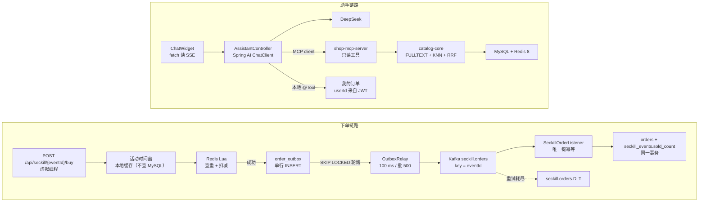
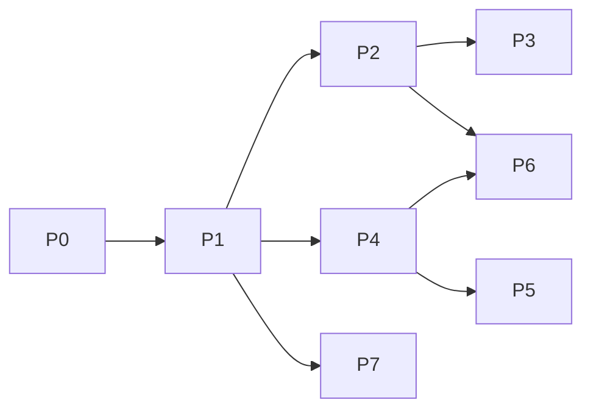

# FTSM 电商平台整体升级方案

2026-10-03 · 基于 `FTSM-upgrade-spec.md`，并对照当前代码（`main` @ `5f5fae4`，v0.4.0）

> 本文讲“改什么、为什么”。逐文件的实现规格（给 agent 执行用）见 [`CHANGE_SPEC.md`](CHANGE_SPEC.md)；两者冲突时以 `CHANGE_SPEC.md` 为准。

---

## 0. 结论速览

规格文档的方向没问题，但它对“现状”的几个假设和代码对不上。照抄会出三类问题：做了没必要的工作，漏掉真正要改的地方，以及简历数字没法自圆其说。本方案把规格落到这个仓库的具体文件上，并调整了顺序：

| 阶段 | 内容 | 对应规格 | 前置阶段 |
| --- | --- | --- | --- |
| **P0** | 打基线 tag、引入 Flyway、mvnw、**先写 k6 并测旧版本基线**（文档对齐与 compose 修复已在 v0.4.3 完成） | 新增（规格里的“改造前先跑基线”提前到这里） | — |
| P1 | Java 21 + Spring Boot 3.5 + 虚拟线程 | 步骤 1 | P0 |
| P2 | Outbox + Kafka 取代 Redis Stream，幂等消费 | 步骤 2 | P1 |
| P3 | k6 正式压测（三种配置对比）+ 争抢测试 | 步骤 3 | P2（基线来自 P0） |
| P4 | Spring AI + MCP server + SSE + Resilience4j | 步骤 4 | P1 |
| P5 | 扩充商品目录、FULLTEXT 基线、Redis 向量、RRF、LLM 重排、评测集 | 步骤 5 | P4（评测集须先人工标注） |
| P6 | Testcontainers、GitHub Actions、K8s、OpenTelemetry | 步骤 6 | P2、P4 |
| P7（可选） | GPT-4o Vision 上架助手（简历第四条提到了，但项目里没有） | 简历第四条 | P1 |

P0–P3 是底线（简历第一条），P6 里的 Testcontainers 和 CI 次之。按 agent 执行时的拆分方式、每个阶段的验收门槛和必须由人完成的部分，见 §12。

---

## 1. 规格假设 vs. 实际代码：差异清单

这一节最重要，后面每个阶段的改法都由它决定。

| # | 规格的假设 | 实际情况（文件） | 影响 |
| --- | --- | --- | --- |
| D1 | Lua 扣减后**同步**写 MySQL 订单 | 已经是**异步**：Lua 成功后 `XADD seckill:orders`，`SeckillStreamConsumer` 每 500 ms 拉取落库（`SeckillService.buy`、`consumer/SeckillStreamConsumer.java`） | P2 的动机要改写：不是“把事务移出热路径”，而是“Redis Stream 不可靠（Lua 和 XADD 不原子；Redis 只有 RDB 快照，重启会丢消息和库存）→ 换成 MySQL Outbox 持久化 + Kafka”。**“相对同步基线提升 Zx”这句话不能直接用**，见 P3。 |
| D2 | 热路径只有 Lua + 一次插入 | `buy()` 第一行 `findEvent(eventId)` **每个请求都查一次 MySQL**（README 说“MySQL is never touched”与事实不符） | P2 里把活动时间窗缓存掉，这是真实的性能收益点 |
| D3 | 商品维度 `skuId`，表 `inventory` | 秒杀维度是 `SeckillEvent`（`eventId` → `productId`），没有 `inventory` 表，秒杀库存在 `seckill_events.seckill_stock` | 规格里的 `skuId` 全部映射为 `eventId`；MySQL 侧扣减改为 `seckill_events.sold_count` |
| D4 | `orders` 可以加 `UNIQUE(user_id, sku_id)` | `orders` 是 C2C / B2C / SECKILL **共用表**，`ref_id` 含义随 `source_type` 变。直接加唯一键会让用户**无法重复购买同一个普通商品** | 新增可空列 `seckill_event_id`，只在秒杀订单上填，唯一键建在 `(buyer_id, seckill_event_id)` 上（MySQL 唯一索引允许多个 NULL） |
| D5 | 订单有 `order_id CHAR(36)` | 已有 `tracking_token`（UUID，`@Column(unique=true)`），轮询接口 `GET /api/seckill/result?token=` 已存在 | 直接复用 `tracking_token` 作为 `orderId`，不新增列 |
| D6 | Lua 返回 0 成功 / 1 售罄 / 2 重复 | 现有脚本 1 成功 / 0 售罄 / -1 重复 / **-2 未预热** | 保留现有返回码（多一个 -2 是好事），只改 key 名加 hash tag |
| D7 | 助手是“手写 function calling” | **没有 function calling**。`ChatService` 只是把名字/类目被消息包含的商品（或商品 ≤10 时全部）拼进 prompt，再调 `/chat/completions` | P4 是从零搭工具调用，不是“替换” |
| D8 | 已有“SQL 关键词预筛 + LLM 重排” | 都没有。商品搜索只有 `findByNameContainingIgnoreCase`（`LIKE %kw%`，只查 name） | P5 要先建一个**公平的关键词基线**（MySQL FULLTEXT），再加向量、RRF、重排 |
| D9 | “你已经在用 OpenAI 的 key” | 项目只有 DeepSeek（`LLM_*` 环境变量）。**DeepSeek 没有 embedding 接口** | 需要选 embedding 提供方，见 §10 决策 1 |
| D10 | 目录有几百个商品 | `DataSeeder` 只种了 **3 个**商品 | P5 必须先造 300–500 条多语言商品数据 |
| D11 | 原有 32 个测试用例 | 实际 **5 个 `@Test`**（3 个测试类）+ `scripts/e2e_test.py` 8 项检查 | 简历第四条的用例数只能用 P6 之后的实测数字 |
| D12 | 有 GPT-4o Vision 上架流程 | **不存在**（`UploadController` 只存文件） | 要么做 P7，要么从简历删掉这半句 |
| D13 | `./mvnw` | 仓库没有 Maven Wrapper；pom 在 `backend/` 子目录 | P0 补 wrapper，CI 设 `working-directory` |
| D14 | Boot 3.3 → 3.5 | 确认是 3.3.5、Java 17、Dockerfile 用 temurin-17 | P1 一并改 Dockerfile |

### 顺带发现的现存问题（P0 修，或在对应阶段修）

| # | 问题 | 位置 | 后果 | 处理阶段 |
| --- | --- | --- | --- | --- |
| B1 | compose 给后端传的是 `GEMINI_API_KEY / GEMINI_MODEL`，而代码读 `LLM_API_KEY / LLM_BASE_URL / LLM_MODEL` | `docker-compose.yml` | **Docker 部署下聊天机器人永远是“未配置”** | ✅ 已在 v0.4.3 修复 |
| B2 | README 技术栈仍写 Gemini、Java 17 | `README.md` | 文档失真 | ✅ 已在 v0.4.3 修复（README / HANDOFF 已与代码对齐） |
| B3 | `reconcileEvents()` 在每个实例上都跑；两个副本可能同时读到 `stockWarmed=false` 并 `SET` 库存 | `SeckillService.reconcileEvents` | 单实例没事；**上 K8s 多副本后，活动开始后的二次预热会把库存重置为满额 → 超卖** | P2（预热改用 `SET NX`）+ P6（ShedLock） |
| B4 | 普通 B2C 下单是“读库存 → 减一 → save”，无锁 | `OrderService.buildProductOrder` | 并发下单普通商品会超卖；C2C 同一件二手物品也可能被卖两次 | P2 顺手改成条件 UPDATE |
| B5 | `ddl-auto: update`，没有迁移工具 | `application.yml` | 唯一键、新表、CHECK 约束无法可靠落地，也没法在 Testcontainers 里复现 | P0 引入 Flyway |
| B6 | 上传文件存本地磁盘 | `UploadController` + `uploads_data` 卷 | K8s 多副本时图片只在一个 Pod 上 | P6（RWX PVC 或 MinIO） |
| B7 | Nginx 未关代理缓冲 | `frontend/nginx.conf` | SSE 会被攒成一整块再吐出，流式失效 | P4 |

---

## 2. 目标架构与仓库结构



改成 Maven 多模块（根目录新增聚合 pom，`backend/` 目录名不动，减少 Docker/文档改动）：

```text
FYP/
├── pom.xml                      # 新增：聚合 + dependencyManagement（spring-ai-bom、testcontainers-bom）
├── mvnw, .mvn/                  # 新增
├── catalog-core/                # 新增：Product/Item 实体与仓库、HybridSearchService、EmbeddingSync
├── backend/                     # 现有主应用（下单、订单、助手、MCP client）
├── mcp-server/                  # 新增：spring-ai-starter-mcp-server-webmvc，依赖 catalog-core
├── frontend/
├── loadtest/                    # 新增：k6 脚本、结果
├── eval/                        # 新增：检索评测集、助手评测集、跑分脚本、结果
├── k8s/                         # 新增：kustomize 清单
├── observability/               # 新增：Grafana dashboard JSON
└── .github/workflows/ci.yml     # 新增
```

`catalog-core` 是为了让主应用和 MCP server 共用同一套检索逻辑；MCP server 不经 HTTP 绕回主应用，直接读 MySQL/Redis，符合规格“独立部署、任何 MCP 客户端可接”的要求。

---

## P0 · 准备工作

目的：在动任何东西之前，把“旧版本”的数字定下来，并扫掉会干扰后续工作的 bug。

1. **打基线 tag**：`git tag v0.4.0-baseline 5f5fae4 && git push origin v0.4.0-baseline`。之后任何时候都能 checkout 回来重测。
2. ~~**修 B1/B2**~~：已在 v0.4.3 完成（compose 改传 `LLM_*`，README/HANDOFF 已对齐）。P1 升级 Java 21 时记得同步改 README 的 JDK 要求。
3. **Maven Wrapper**：`mvn wrapper:wrapper -Dmaven=3.9.11`（先放在 `backend/`，P4 拆多模块时移到根目录）。
4. **Flyway**：
   - 加 `flyway-core` + `flyway-mysql`（Boot 3.x 没有 flyway starter，版本由 Boot 管理）。
   - 用当前 schema 导出 `V1__baseline.sql`（`mysqldump --no-data`），配置 `spring.flyway.baseline-on-migrate=true`，`ddl-auto` 改成 `validate`。
   - 后续每个阶段的表结构变更都写成 `V2__...sql`、`V3__...sql`。
   - H2 profile 保留给本地快速启动，但 Flyway 脚本以 MySQL 方言为准；测试改用 Testcontainers（P6）。
5. **k6 脚本 + 基线测量**（见 P3 的脚本，P0 先写好）：
   - 认证：**不加 `X-Test-User` 后门**。`JwtAuthFilter` 只校验签名、不查库，所以 k6 可以用测试环境的 `JWT_SECRET` 直接在脚本里签 HS256 token（`k6/crypto` 的 `hmac` + `k6/encoding` 的 `b64encode(..., 'rawurl')`），或用 `loadtest/gen_tokens.py` 预生成一个 token 池。这样压测走的是真实的鉴权链路，生产配置里也不存在可被利用的测试头。
   - 用户 ID 必须是数字（`AuthPrincipal.userId` 是 `Long`），用 `__VU * 1_000_000 + __ITER`。
   - 在 `v0.4.0-baseline` 上跑吞吐场景和争抢场景，结果存 `loadtest/results/baseline-redis-stream/`。

验收：`docker compose up` 后聊天机器人可用；`mvnw verify` 通过；基线结果文件已提交。

---

## P1 · Java 21 + Spring Boot 3.5 + 虚拟线程

改动：

| 文件 | 改什么 |
| --- | --- |
| `backend/pom.xml` | parent → `3.5.x`；`java.version` → `21`；Lombok 升到当前最新 1.18.x |
| `backend/Dockerfile` | `maven:3.9-eclipse-temurin-21`、`eclipse-temurin:21-jre`；`ENTRYPOINT` 加 `-XX:MaxRAMPercentage=75` |
| `application.yml` | `spring.threads.virtual.enabled: true`；`spring.datasource.hikari.maximum-pool-size: ${DB_POOL_SIZE:20}`（之后作为压测参数） |
| README / HANDOFF | JDK 要求改为 21 |

注意事项：

- 开虚拟线程后，`@Scheduled` 也跑在虚拟线程上，`reconcileEvents` 和后面的 `OutboxRelay` 不受影响。
- 用 `-Djdk.tracePinnedThreads=short` 跑一次压测，检查 pinning。mysql-connector-j 9.x 已把 `synchronized` 换成 `ReentrantLock`，Boot 3.5 管理的版本就够新。
- **可选**：如果想彻底消除 `synchronized` pinning，可以上 JDK 25 LTS（JEP 491），但要确认 Lombok ≥ 1.18.40；简历写 “Java 21+” 也成立。默认按规格用 21，当前容器里就是 21.0.11。
- **版本核实**：Boot 3.5 的开源支持期可能已经结束，动手当天看一下 spring.io 的支持表。如果 3.5 已经停止维护，可以直接上 Boot 4 + Spring AI 2.x；P4 的代码基本不变，只是包名和 starter 名可能有差异。

验收：`mvnw verify` 绿；e2e_test.py 8/8；`/actuator/health` UP。

---

## P2 · Outbox + Kafka 异步落单

### 2.1 数据库迁移 `V2__seckill_outbox.sql`

```sql
CREATE TABLE order_outbox (
  id          BIGINT AUTO_INCREMENT PRIMARY KEY,
  order_id    CHAR(36)    NOT NULL,          -- = orders.tracking_token
  user_id     BIGINT      NOT NULL,
  event_id    BIGINT      NOT NULL,          -- 规格里的 sku_id
  payload     JSON        NOT NULL,
  status      TINYINT     NOT NULL DEFAULT 0, -- 0 NEW, 1 SENT
  created_at  DATETIME(3) NOT NULL DEFAULT CURRENT_TIMESTAMP(3),
  sent_at     DATETIME(3) NULL,
  UNIQUE KEY uk_order_id (order_id),
  KEY idx_status_id (status, id)
);

-- 秒杀订单专用列；普通订单为 NULL，不受唯一键影响
ALTER TABLE orders
  ADD COLUMN seckill_event_id BIGINT NULL,
  ADD UNIQUE KEY uk_buyer_seckill (buyer_id, seckill_event_id);
-- tracking_token 已有唯一约束，即规格里的 uk_order_id

ALTER TABLE seckill_events
  ADD COLUMN sold_count INT NOT NULL DEFAULT 0;
```

`Order` 实体加 `seckillEventId` 字段；`SeckillEvent` 加 `soldCount`。

### 2.2 Redis key 与 Lua

`utils/RedisKeys.java`：

```java
public static String seckillStock(Long eventId)  { return "seckill:stock:{" + eventId + "}"; }
public static String seckillBought(Long eventId) { return "seckill:bought:{" + eventId + "}"; }
// 删除 seckillOrdersStream / seckillConsumerGroup
```

`seckill_deduct.lua` 逻辑不变（保留 1/0/-1/-2 返回码），只更新注释里的 key 名。

新增 `scripts/seckill_rollback.lua`（补偿用；用 SREM 的返回值保证幂等，重复执行不会多加库存）：

```lua
-- KEYS[1] = stock  KEYS[2] = bought  ARGV[1] = userId
if redis.call('SREM', KEYS[2], ARGV[1]) == 1 then
  redis.call('INCR', KEYS[1])
  return 1
end
return 0
```

预热改成 `SET key value NX`（`opsForValue().setIfAbsent`），修 B3 的竞态：重复预热不会覆盖已经开始扣减的库存。编辑 PENDING 活动时先 `DEL` 再预热。

### 2.3 热路径 `SeckillService.buy`

```java
public BuyOutcome buy(Long userId, Long eventId) {
    EventWindow w = eventWindowCache.get(eventId);          // Caffeine, TTL 5s；不再每次查 MySQL
    if (w == null || !w.isActive(Instant.now())) return BuyOutcome.notActive();

    Long r = redis.execute(deductScript, keys(eventId), String.valueOf(userId));
    if (r == null || r == -2) return BuyOutcome.notActive();
    if (r == 0)  return BuyOutcome.soldOut();
    if (r == -1) return BuyOutcome.alreadyBought();

    String orderId = UUID.randomUUID().toString();
    try {
        outboxDao.insert(orderId, userId, eventId, payloadJson(...));   // JdbcTemplate，单行 INSERT，自动提交
    } catch (DataAccessException e) {
        redis.execute(rollbackScript, keys(eventId), String.valueOf(userId));
        log.error("[SecKill] outbox insert failed, slot returned", e);
        return BuyOutcome.unavailable();                                  // → 503
    }
    return BuyOutcome.accepted(orderId);
}
```

- 用 `JdbcTemplate` 而不是 JPA 写 outbox：热路径少一层持久化上下文，也不需要 `@Transactional`。
- `EventWindow` 只包含 `productId / price / start / end`。活动只能在 PENDING 时编辑，5 秒 TTL 足够；编辑或删除时主动 `invalidate`。

`SeckillController.buy` 的状态码：

| 结果 | HTTP | body.result |
| --- | --- | --- |
| ACCEPTED | 202 | `ACCEPTED` + `trackingToken` |
| SOLD_OUT / ALREADY_BOUGHT | 409 | 原值 |
| NOT_ACTIVE | 409 | 原值 |
| outbox 失败 | 503 | `UNAVAILABLE` |

body 结构不变，所以前端 `SeckillCard.tsx` 不用改：非 2xx 时 axios 会进 `catch`，那里已经读取 `err.response.data.message`。路径保持 `/api/seckill/{eventId}/buy`，不按规格改成 `/api/flash-sale/...`；如果想在简历或 README 里用规格的路径，再加一个别名映射即可。轮询接口沿用 `GET /api/seckill/result?token=`。

### 2.4 Relay（`seckill/OutboxRelay.java`）

```java
@Scheduled(fixedDelayString = "${app.seckill.relay-interval-ms:100}")
@Transactional
public void relay() {
    List<OutboxRow> rows = jdbc.query("""
        SELECT id, order_id, event_id, payload FROM order_outbox
        WHERE status = 0 ORDER BY id LIMIT 500 FOR UPDATE SKIP LOCKED""", MAPPER);
    if (rows.isEmpty()) return;

    var futures = rows.stream()
        .map(r -> kafka.send(TOPIC, String.valueOf(r.eventId()), r.payload()))
        .toList();
    CompletableFuture.allOf(futures.toArray(CompletableFuture[]::new)).get(10, SECONDS); // 任一失败 → 抛出 → 整批回滚

    jdbc.batchUpdate("UPDATE order_outbox SET status = 1, sent_at = NOW(3) WHERE id = ?", ids(rows));
}
```

和规格的区别：规格写的是逐条发送、逐条等待确认，这样每批要做 500 次网络往返，吞吐上限很低。这里改成整批发出、统一等待；只要有一条失败，整批回滚，已经发出去的那些会被重发，消费者靠唯一键去重。

生产者配置：`acks=all`、`enable.idempotence=true`、`max.in.flight.requests.per.connection=5`（开启幂等后最大可设 5，仍能保证分区内有序）、`linger.ms=5`。

另加 `OutboxJanitor`：每小时删除 `status=1 AND sent_at < NOW() - INTERVAL 3 DAY` 的行。

### 2.5 幂等消费者（`seckill/SeckillOrderListener.java` + `SeckillOrderWriter.java`）

```java
@KafkaListener(topics = "seckill.orders", groupId = "seckill-order-writer", concurrency = "3")
public void onMessage(SeckillOrderMessage m) {
    try {
        writer.persist(m);                          // @Transactional 在 writer 上
    } catch (DataIntegrityViolationException dup) {
        log.debug("[SecKill] duplicate {}, skip", m.orderId());   // 幂等：视为已处理
    }
}
```

```java
@Transactional
public void persist(SeckillOrderMessage m) {
    orderRepository.saveAndFlush(Order.builder()
        .buyerId(m.userId()).sourceType(SECKILL).refId(m.eventId()).seckillEventId(m.eventId())
        .amount(m.price()).paymentMethod("FAKE_WALLET").trackingToken(m.orderId())
        .status(PENDING).build());
    int n = eventRepository.incrementSold(m.eventId());   // UPDATE ... SET sold_count = sold_count + 1 WHERE id = ? AND sold_count < seckill_stock
    if (n == 0) throw new IllegalStateException("MySQL stock guard tripped for event " + m.eventId()); // → 重试 → DLT + 告警
    orderService.settle(order, "FAKE_WALLET");
}
```

要点：

- **事务边界放在 writer 上，不放在 listener 上。** 如果 `@Transactional` 加在 listener 方法上，`saveAndFlush` 撞唯一键时事务会被标记为 rollback-only，在同一个方法里 catch 住也照样会在提交时抛出 `UnexpectedRollbackException`。规格里“捕获 DuplicateKeyException 直接确认”只有在这种拆法下才成立。另外 JPA 抛出的是 `DataIntegrityViolationException`，`DuplicateKeyException` 是 JdbcTemplate 路径上的子类。
- `sold_count < seckill_stock` 是 MySQL 一侧的第二道防线：即使 Redis 出错，MySQL 也不会多落单。
- Spring Kafka 配置：`enable-auto-commit: false`、`ack-mode: RECORD`（listener 正常返回才提交 offset）、`DefaultErrorHandler(new DeadLetterPublishingRecoverer(template), new FixedBackOff(1000, 3))`。
- topic 用 `NewTopic` bean 声明：`seckill.orders`（6 个分区）和 `seckill.orders.DLT`。
- 删除 `consumer/SeckillStreamConsumer.java`。

### 2.6 对账任务（`seckill/SeckillReconciler.java`）

活动进入 ENDED 后跑一次：比较 `seckill_stock - redis剩余`、`sold_count`、`COUNT(orders WHERE seckill_event_id=?)`、`COUNT(order_outbox WHERE event_id=? AND status=0)` 四个数。不一致就打 WARN 日志并记一个 Micrometer counter。规格“设计取舍”一节提到的“少卖可发现”就靠它兑现。

### 2.7 顺手修 B4

`OrderService.buildProductOrder` 改成 `UPDATE products SET total_stock = total_stock - 1 WHERE id = ? AND total_stock > 0`，影响行数为 0 就抛 `BusinessException`。C2C 同理：`UPDATE items SET status='SOLD' WHERE id=? AND status='ACTIVE'`。

### 2.8 基础设施

`docker-compose.yml` 增加：

```yaml
  kafka:
    image: apache/kafka:3.9.1         # KRaft 单节点；动手当天确认最新稳定版
    environment:
      KAFKA_NODE_ID: 1
      KAFKA_PROCESS_ROLES: broker,controller
      KAFKA_LISTENERS: PLAINTEXT://:9092,CONTROLLER://:9093
      KAFKA_ADVERTISED_LISTENERS: PLAINTEXT://kafka:9092
      KAFKA_CONTROLLER_QUORUM_VOTERS: 1@kafka:9093
      KAFKA_CONTROLLER_LISTENER_NAMES: CONTROLLER
      KAFKA_OFFSETS_TOPIC_REPLICATION_FACTOR: 1
  redis:
    image: redis:8                    # P5 的向量检索需要，现在一起换
    command: ["redis-server", "--appendonly", "yes"]   # 库存和买家集合需要持久化
```

依赖：`spring-kafka`、`com.github.ben-manes.caffeine:caffeine`。

### 2.9 验收（先手工验证，P6 再写成集成测试）

- [ ] `e2e_test.py --users 200 --stock 50`：订单数 = 50，Redis 库存 = 0，`sold_count` = 50，没有同一用户的两张单。
- [ ] 秒杀进行中 `docker compose kill backend` 再启动：订单数仍然正确（outbox 有积压就会被继续发送）。
- [ ] `docker compose pause kafka` 30 秒后恢复：下单接口照常返回 202，outbox 积压，恢复后全部送达。
- [ ] `kafka-consumer-groups --reset-offsets --to-earliest --execute` 重放：订单数不变。
- [ ] `-Djdk.tracePinnedThreads=short` 日志里没有大量 pinning。

---

## P3 · k6 压测

### 3.1 文件

```text
loadtest/
├── lib/jwt.js               # 在 k6 内签 HS256
├── throughput.js            # ramping-arrival-rate
├── contention.js            # 争抢：N 个用户抢 S 件库存
├── setup_event.sh           # 用管理员 token 创建商品和活动（stock=1_000_000 / 100）
├── verify.sql               # 结束后的核对 SQL
└── results/<config>/<run>.txt
```

### 3.2 关键调整（相对规格的脚本）

- 吞吐场景：库存要大于总请求数。3000 rps × 210 s ≈ 63 万，所以设 `seckill_stock = 1_000_000`。注意 `createEvent` 校验了 `seckillStock <= product.totalStock`，商品库存也要设到 100 万。
- 请求头改成 `Authorization: Bearer ${signJwt(userId)}`。
- 每次运行前用 `FLUSHDB` 加 `TRUNCATE orders, order_outbox` 重置状态，保证三次运行条件一致。
- 核对 SQL 改成：`SELECT COUNT(*), COUNT(DISTINCT buyer_id) FROM orders WHERE seckill_event_id = ?`。这两个数都应该等于 `orders_accepted`。要等 outbox 和 consumer lag 都清零后再查。

### 3.3 测三种配置

D1 已经说明，旧版本是 Redis Stream 异步落单，而不是规格以为的同步落单。所以要诚实地测三组：

| 配置 | 怎么得到 | 意义 |
| --- | --- | --- |
| A. 旧版 | `v0.4.0-baseline` tag（Java 17、Redis Stream、热路径查 MySQL） | 真实基线 |
| B. 同步落单 | 新代码加 `app.seckill.mode=sync`（仅 test profile）：Lua 成功后直接调用 `SeckillOrderWriter.persist` | 规格里“同步基线”的含义；用来算 Zx |
| C. 新版 | Outbox + Kafka + 虚拟线程 | 简历数字 |

预期：C 相对 B 应该有明显提升（多表事务被移出了热路径）。C 相对 A 不一定更快，因为 C 在热路径上多了一次 MySQL INSERT，但去掉了 `findEvent` 查询，并换来了持久性。不管结果如何都如实写进 README，“设计取舍”一节正好用得上。

此外以 `maximum-pool-size` ∈ {10, 20, 40} 和虚拟线程开/关做一组小矩阵，只放进 README，不进简历。

### 3.4 环境记录

记录 CPU 型号/核数、内存、Docker 资源限制、k6 是否与服务同机。每档跑 3 次取中位数，k6 加 `--summary-export` 导出 JSON。

---

## P4 · Agent 助手：Spring AI + MCP + SSE + Resilience4j

### 4.1 拆模块

1. 根目录新建聚合 `pom.xml`，`<modules>catalog-core, backend, mcp-server</modules>`，导入 `spring-ai-bom`。
2. `catalog-core`：把 `Product`、`Item` 实体和仓库移进来（包名不变，避免改动 import），新增 `CatalogSearchService`（P4 先只做 FULLTEXT 检索，P5 再加向量和 RRF）。
3. `backend` 依赖 `catalog-core`，`@EntityScan` / `@EnableJpaRepositories` 覆盖两个包。

### 4.2 MCP server（`mcp-server/`）

- 依赖：`spring-ai-starter-mcp-server-webmvc`、`catalog-core`、data-jpa、data-redis。
- 端口 8081；只读数据库账号（`GRANT SELECT`），从权限上保证只读。
- 工具（`ShopTools.java`；注解名以 Spring AI 1.1 文档为准，1.1 用的是 `@McpTool` / `@McpToolParam`，也可以用 `@Tool` + `MethodToolCallbackProvider`）：

| 工具 | 参数 | 数据来源 |
| --- | --- | --- |
| `search_products` | `keyword`, `maxPrice?`, `category?` | `CatalogSearchService`（B2C 商品） |
| `search_secondhand_items` | `keyword`, `maxPrice?` | 同上（C2C 在售二手） |
| `get_product_detail` | `productId` | MySQL + 评价均分 |
| `get_stock` | `productId` | `products.total_stock`；如果该商品有进行中的秒杀，再读 Redis `seckill:stock:{eventId}` |
| `list_flash_sales` | `status?` | `seckill_events`（PENDING/ACTIVE） |

每个 description 用英文写，并写清楚什么时候该调用（DeepSeek 对英文 description 的工具选择更稳）。

### 4.3 订单工具的身份问题：采用方案一

订单工具作为本地 `@Tool` 留在 backend，用户 ID 通过 `ToolContext` 传入，**模型参数里不出现 userId**：

```java
@Tool(description = "List the current user's recent orders and their status")
List<OrderView> myOrders(ToolContext ctx) {
    Long userId = (Long) ctx.getContext().get("userId");
    return orderService.listForBuyer(userId).stream().limit(10).map(OrderView::from).toList();
}
```

简历措辞相应调整为 “catalogue and stock tools served over MCP; order tools scoped to the authenticated user”。比方案二（向 MCP 转发身份）简单，安全边界也更清楚。

### 4.4 助手服务（backend 内，替换 `ChatService`）

- 依赖：`spring-ai-starter-mcp-client`、`spring-ai-starter-model-deepseek`、`resilience4j-spring-boot3`、`resilience4j-reactor`。
- 配置：`spring.ai.mcp.client.streamable-http.connections.shop.url=http://mcp-server:8081`（具体 key 以文档为准）；`spring.ai.deepseek.api-key=${LLM_API_KEY}`、`chat.options.model=${LLM_MODEL}`。**先确认所选 DeepSeek 模型支持 tool calling**（历史上 reasoner 类模型不支持）。
- 会话记忆：`MessageWindowChatMemory`（最近 10 条），以 `conversationId = userId + 前端生成的会话 UUID` 为键。

```java
@PostMapping(value = "/api/assistant/stream", produces = MediaType.TEXT_EVENT_STREAM_VALUE)
public Flux<ServerSentEvent<String>> stream(@AuthenticationPrincipal AuthPrincipal p,
                                            @Valid @RequestBody ChatRequest req) {
    Long userId = p.userId();                    // 在进入 Reactor 线程之前取出身份
    return assistant.stream(userId, req.conversationId(), req.message())
            .map(chunk -> ServerSentEvent.builder(chunk).build());
}
```

```java
@RateLimiter(name = "llm") @CircuitBreaker(name = "llm", fallbackMethod = "fallback")
public Flux<String> stream(Long userId, String convId, String q) {
    return chatClient.prompt().user(q)
        .toolContext(Map.of("userId", userId))
        .advisors(a -> a.param(ChatMemory.CONVERSATION_ID, userId + ":" + convId))
        .stream().content()
        .timeout(Duration.ofSeconds(20), Flux.error(new TimeoutException("first token")));
}
Flux<String> fallback(Long u, String c, String q, Throwable t) { return Flux.just("助手暂时不可用，请稍后再试。"); }
```

- 保留旧的 `POST /api/chat`（非流式），内部改成 `stream().collectList()`，避免一次改动打断前端。
- **为什么用 POST 而不是规格里的 GET + EventSource**：`EventSource` 不能设置 `Authorization` 头，而本项目的 JWT 放在请求头里；把 token 放进 URL 又会被写进访问日志。所以前端用 `fetch` + `ReadableStream` 解析 SSE（或用 `@microsoft/fetch-event-source`）。
- Spring Security：MVC 返回 `Flux` 会走异步分派，需要 `.dispatcherTypeMatchers(DispatcherType.ASYNC).permitAll()`，并设置 `spring.mvc.async.request-timeout=60s`。
- Nginx（修 B7）：

```nginx
location /api/assistant/stream {
    proxy_pass http://backend:8080/api/assistant/stream;
    proxy_buffering off;
    proxy_cache off;
    proxy_read_timeout 300s;
    proxy_http_version 1.1;
    proxy_set_header Connection "";
}
```

### 4.5 前端

- `services/api.ts` 新增 `assistantApi.stream(message, convId, onChunk)`，用 `fetch` 带上 `useAuthStore` 里的 token。
- `ChatWidget.tsx`：先追加一个空的 assistant 气泡，每收到一段就把文字追加进去；显示“正在查询库存…”这类工具调用提示（可选：后端在工具调用时发一个 `event: tool` 的 SSE 事件）。

### 4.6 验收与评测

- [ ] `npx @modelcontextprotocol/inspector` 连上 `http://localhost:8081`，列出并调用 5 个工具，截图。
- [ ] 问“FTSM Hoodie 还有货吗”：日志里能看到 `get_stock`（开 `SimpleLoggerAdvisor` 或 DEBUG 日志），回答里的数字和 Redis/MySQL 一致。
- [ ] 改错 API key 连续请求：熔断器打开（`/actuator/circuitbreakers` 可以看到 OPEN），接口立即返回 fallback。
- [ ] `eval/assistant_questions.jsonl`：25 条，每条带 `expected_tools`。`eval/run_assistant_eval.py` 统计工具选择准确率、首 token 延迟的 p50/p95。工具调用情况通过 Spring AI 的 observation 或自定义 advisor 记录到日志里，再由脚本解析。

---

## P5 · 混合检索与评测

### 5.1 先造数据（D10）

- `scripts/gen_catalog.py`：生成 400 个 B2C 商品和 200 个 C2C 二手物品，覆盖 10 个左右类目（文具、电子、服饰、书籍、宿舍用品……）。标题和描述按 6:2:2 混用英语、马来语、中文，价格合理分布。可以用 LLM 生成草稿，但**要人工过一遍**，并存成 `data/catalog.json` 提交进仓库。
- 新增 `demo` profile 的 seeder：商品表为空时导入 `catalog.json`。图片用 placeholder。

### 5.2 评测集（先标注，后实现）

`eval/queries.jsonl`，80 条，每条 `{"q": "...", "relevant": [ids], "type": "lexical|synonym|crosslingual|constraint"}`，四类各 20 条。**在写向量检索代码之前完成标注并提交**，用 git 历史证明标注先于实现。

### 5.3 关键词基线：用 FULLTEXT，不用 LIKE

`V3__fulltext.sql`：

```sql
ALTER TABLE products ADD FULLTEXT INDEX ft_products (name, description, category) WITH PARSER ngram;
ALTER TABLE items    ADD FULLTEXT INDEX ft_items (title, description, category) WITH PARSER ngram;
```

ngram 解析器同时支持中文和空格分词的语言。查询用 `MATCH(...) AGAINST(? IN NATURAL LANGUAGE MODE)`，取前 20 条。README 里可以把现在的 `LIKE` 作为第 0 行一并列出，但简历的基线用 FULLTEXT。拿 `LIKE` 当基线是稻草人，提升数字会虚高，面试时容易被追问。

### 5.4 向量召回

- Redis 8 自带查询引擎（P2 已经换了镜像）。
- 用 Spring AI `spring-ai-starter-vector-store-redis`：索引名 `idx:catalog`，前缀 `catalog:`，元数据字段 `type`(TAG: product/item)、`category`(TAG)、`price`(NUMERIC)、`refId`。带属性约束的查询（“200 令吉以内”）走 `price <= 200` 的过滤表达式，即 Redis 的 `(@price:[0 200])=>[KNN 20 @embedding $vec]` 预过滤。注意 RedisVectorStore 底层用 Jedis，和应用里的 Lettuce 可以共存。
- 嵌入文本：`title + " | " + category + " | " + description`。
- 同步：`ProductService` / `ItemService` 增删改后发布 `CatalogChangedEvent`，用 `@TransactionalEventListener(phase = AFTER_COMMIT)` 异步重新生成向量；另有一次性回填命令 `--catalog.reindex=true`。
- Embedding 模型：见 §10 决策 1。

### 5.5 RRF 与重排（`catalog-core/.../HybridSearchService.java`）

```java
List<Hit> search(String q, Filters f, Mode mode) {
    List<Long> kw  = keywordRecall(q, f, 20);
    List<Long> vec = vectorRecall(q, f, 20);
    Map<Long, Double> score = new HashMap<>();
    for (int i = 0; i < kw.size();  i++) score.merge(kw.get(i),  1.0 / (60 + i + 1), Double::sum);
    for (int i = 0; i < vec.size(); i++) score.merge(vec.get(i), 1.0 / (60 + i + 1), Double::sum);
    List<Long> fused = top(score, 10);
    return mode == Mode.RRF_RERANK ? llmRerank(q, fused, 5) : fused.subList(0, min(5, fused.size()));
}
```

- `llmRerank`：把查询和 10 个候选的 `id + title + 简短描述` 发给 DeepSeek，要求以 JSON 返回排序后的 id 数组（Spring AI `.entity(RerankResult.class)`）；解析失败时退回 RRF 顺序。
- 对外接口：`GET /api/search?q=&maxPrice=&category=`，默认 `RRF_RERANK`；dev/test profile 下额外接受 `mode=keyword|vector|rrf|rrf_rerank` 和 `debug=true`（返回每一路的名次）。Marketplace 搜索框改用这个接口。

### 5.6 跑分

`eval/run_retrieval_eval.py`：对四种 mode 各跑一遍全部查询，计算 Recall@5、MRR、p50 延迟。费用由 token 数 × 单价估算，embedding 和 rerank 分别记。结果输出到 `eval/results/<date>.md`，同时按 `type` 分组。按规格的判断，后三类查询应该是差距所在，分组表比单一总分更有说服力。

---

## P6 · 测试、CI、Kubernetes、可观测性

### 6.1 Testcontainers

依赖：`spring-boot-testcontainers`、`org.testcontainers:mysql`、`org.testcontainers:kafka`、`com.redis:testcontainers-redis`（或 `GenericContainer("redis:8")` + `@ServiceConnection(name = "redis")`）。

`TestcontainersConfig`：三个容器都声明成 `@Bean @ServiceConnection`。Flyway 在 MySQL 容器上自动执行迁移，这也是 P0 引入 Flyway 的原因之一。

| 测试类 | 内容 |
| --- | --- |
| `SeckillConcurrencyIT` | `Executors.newVirtualThreadPerTaskExecutor()` 发 2000 个请求抢 100 件；用 Awaitility 等待 outbox 清空、订单数 = 100；断言 Redis 库存为 0、`sold_count` = 100、`COUNT(DISTINCT buyer_id)` = 100 |
| `ConsumerRestartIT` | 处理到一半时 `registry.getListenerContainer(id).stop()` 再 `start()`，订单数正确 |
| `KafkaOutageIT` | `kafka.getDockerClient().pauseContainerCmd(...)` 暂停 30 秒（测试里可以缩短到 10 秒），期间下单仍然返回 202，恢复后订单全部落库 |
| `ReplayIT` | 用 `AdminClient.alterConsumerGroupOffsets` 把 offset 重置到 0，重放后订单数不变 |
| `OrderToolSecurityTest` | 模型无法让订单工具返回其他用户的订单（直接调用工具，验证 ToolContext 的身份隔离） |
| `HybridSearchServiceTest` | RRF 融合的纯单元测试 |
| `ProductOrderRaceIT` | B4 修复的回归测试 |

保留现有 5 个单元测试。`maven-failsafe-plugin` 运行 `*IT`。

### 6.2 GitHub Actions（`.github/workflows/ci.yml`）

```yaml
name: ci
on: [push, pull_request]
permissions: { contents: read, packages: write }
jobs:
  backend:
    runs-on: ubuntu-latest
    steps:
      - uses: actions/checkout@v4
      - uses: actions/setup-java@v4
        with: { distribution: temurin, java-version: '21', cache: maven }
      - run: ./mvnw -B verify
      - uses: actions/upload-artifact@v4
        if: always()
        with: { name: test-reports, path: '**/target/*-reports/' }
  frontend:
    runs-on: ubuntu-latest
    defaults: { run: { working-directory: frontend } }
    steps:
      - uses: actions/checkout@v4
      - uses: actions/setup-node@v4
        with: { node-version: 20, cache: npm, cache-dependency-path: frontend/package-lock.json }
      - run: npm ci && npm run build
  images:
    needs: [backend, frontend]
    if: github.ref == 'refs/heads/main'
    runs-on: ubuntu-latest
    strategy: { matrix: { svc: [backend, mcp-server, frontend] } }
    steps:
      - uses: actions/checkout@v4
      - uses: docker/login-action@v3
        with: { registry: ghcr.io, username: '${{ github.actor }}', password: '${{ secrets.GITHUB_TOKEN }}' }
      - uses: docker/build-push-action@v6
        with:
          context: .
          file: ${{ matrix.svc }}/Dockerfile
          push: true
          tags: ghcr.io/${{ github.repository_owner }}/ftsm-${{ matrix.svc }}:${{ github.sha }}
```

拆成多模块后 Dockerfile 的构建上下文要改成根目录（需要根 pom 和 `catalog-core`）。注意 GHCR 镜像名必须全小写；仓库名 `FYP` 是大写，所以这里用 `repository_owner` 拼接。

### 6.3 Kubernetes（`k8s/`，kustomize）

```text
k8s/
├── kustomization.yaml
├── namespace.yaml
├── secrets.example.yaml        # JWT_SECRET, DB_PASSWORD, LLM_API_KEY（真实值不入库）
├── mysql.yaml  redis.yaml  kafka.yaml      # 单副本 StatefulSet + headless Service
├── backend.yaml                # Deployment(2) + Service + HPA；requests.cpu 500m
├── mcp-server.yaml
├── frontend.yaml               # nginx，含 SSE 配置
└── observability.yaml          # grafana/otel-lgtm
```

上 K8s 之前要先解决的多副本问题：

- **B3**：`reconcileEvents` 加 ShedLock（`shedlock-provider-jdbc-template`，加一张 `shedlock` 表），只让一个副本执行。P2 的 `SET NX` 是第二道保险。
- `OutboxRelay`：`SKIP LOCKED` 本身就支持多副本，不需要 ShedLock。
- **B6**：上传文件。kind 环境下用一个 `ReadWriteMany` 的 hostPath PVC 应急，或者部署一个 MinIO，`UploadController` 改为写 S3。简历里没提这一点，可以选最省事的做法，但必须处理，否则多副本时图片会随机 404。
- 探针：`management.endpoint.health.probes.enabled=true`，liveness 和 readiness 分别指向对应的 actuator 路径。
- kind 安装 metrics-server 时要加 `--kubelet-insecure-tls` 参数。

### 6.4 OpenTelemetry / Prometheus / Grafana

- 在 Dockerfile 里下载 `opentelemetry-javaagent.jar`（固定版本号），`JAVA_TOOL_OPTIONS=-javaagent:/otel/agent.jar`；环境变量 `OTEL_SERVICE_NAME`、`OTEL_EXPORTER_OTLP_ENDPOINT=http://lgtm:4318`。
- `micrometer-registry-prometheus`，暴露 `/actuator/prometheus`，由 LGTM 里的采集器抓取。
- 自定义指标：
  - `seckill_outbox_backlog`（Gauge，每 5 秒执行一次 `SELECT COUNT(*) WHERE status=0`）
  - `seckill_buy_total{result=...}`（Counter）
  - `seckill_reconcile_mismatch_total`
- Kafka consumer lag：Spring Kafka 的 Micrometer 集成会暴露 `kafka_consumer_fetch_manager_records_lag_max`。
- `observability/grafana/seckill.json`：QPS、p99、outbox 积压、consumer lag、HikariCP 活跃连接数、熔断器状态，共 6 个面板，纳入版本控制。
- 验收截图：一次下单的 trace 包含 HTTP → Redis EVALSHA → MySQL INSERT outbox → （relay 的独立 trace，通过 Kafka 头部关联）→ consumer → MySQL INSERT orders。注意 relay 是定时任务发送，不是请求线程发送，**trace 不会自动从 HTTP 请求延续到 Kafka**。如果想在 Grafana 里看到一条完整的链，要在 outbox 的 payload 里存 `traceparent`，relay 发送时把它写进 Kafka 消息头（大约 20 行代码）。否则只能看到“HTTP + outbox 插入”和“relay → Kafka → 消费者落单”两段 trace。这一点规格里没写，但关系到那张截图能不能做出来。

---

## P7（可选）· GPT-4o Vision 上架助手

简历第四条写了 “multimodal listing pipeline using GPT-4o Vision”，但仓库里没有。要么做，要么删。做的话范围很小：

- `POST /api/items/draft-from-image`：接收已上传的图片 URL，调用 OpenAI 视觉模型，用结构化输出返回 `{title, category, condition, suggestedPrice, description}`。
- `SellItem.tsx`：上传图片后点击“AI 自动填写”，把结果填进表单，用户确认后再提交。
- 需要 OpenAI key。如果 §10 决策 1 选了 OpenAI embedding，可以共用同一个 key。

---

## 10. 需要你拍板的决策

| # | 问题 | 选项 | 我的建议 |
| --- | --- | --- | --- |
| 1 | Embedding 提供方（DeepSeek 没有 embedding 接口） | a) OpenAI `text-embedding-3-small`：600 个商品回填的费用几乎为零，需要新 key；b) Ollama 本地 `bge-m3`：免费，跨语言（中/英/马来）效果好，但 compose 和 K8s 要多跑一个容器，CPU 推理较慢；c) Spring AI ONNX 默认的 MiniLM：只支持英文，**跨语言那一类会很差** | 有 OpenAI key 就选 a（顺便支撑 P7），没有就选 b。不要选 c |
| 2 | Spring Boot 版本 | 3.5.x + Spring AI 1.1.x（按规格）或 4.x + Spring AI 2.x | 动手当天确认 3.5 是否仍在开源支持期内；还在就按规格走 |
| 3 | 简历第四条的 GPT-4o Vision | 做 P7 / 删掉 | 做，成本低，演示效果好 |
| 4 | 订单工具放在哪 | 方案一：本地 `@Tool` / 方案二：MCP + 转发身份 | 方案一 |
| 5 | 秒杀接口路径 | 保留 `/api/seckill/{id}/buy` / 改成规格的 `/api/flash-sale/{skuId}/orders` | 保留，可选加别名 |

---

## 11. 简历条目修订建议

在规格原文基础上，按本方案的实际实现修改：

```text
• Engineered a flash-sale engine combining atomic Redis Lua check-and-decrement with
  Kafka-based asynchronous order creation (transactional outbox, idempotent consumers,
  DB-level stock guard) on Java 21 virtual threads; zero oversell under contention and
  sustained [X] QPS at [Y] ms p99 at a [N] req/s k6 arrival rate ([Z]x over a
  synchronous-write baseline).
• Built an agentic shopping assistant with Spring AI: catalogue, stock and flash-sale
  tools served by a standalone Model Context Protocol (MCP) server over live MySQL/Redis
  state, user-scoped order tools, SSE streaming, and Resilience4j rate limiting and
  circuit breaking around model calls.
• Designed a hybrid retrieval pipeline (MySQL FULLTEXT + Redis vector search fused via
  Reciprocal Rank Fusion, then LLM re-ranking), raising Recall@5 from [A] to [B] on an
  [N]-query trilingual (EN/MS/ZH) labelled evaluation set.
• [Shipped a GPT-4o Vision listing assistant;] deployed on Kubernetes with HPA, GitHub
  Actions CI/CD, [M] Testcontainers-backed tests (MySQL/Kafka/Redis), and OpenTelemetry
  tracing with Prometheus/Grafana dashboards.
```

改动说明：

- 第一条：“相对同步基线”对应 P3 的配置 B，有数据支撑；“N-user” 改成到达率，更准确。
- 第二条：去掉 “RAG”。助手查的是实时数据，不是文档检索，写 RAG 容易在面试里被问住。
- 第三条：基线写明是 FULLTEXT。

---

## 12. 用 agent 执行

每个阶段交给一个 agent 会话完成，各开一个分支、各提一个 PR。合并之前，PR 必须通过下面的验收门槛，agent 不能用“已实现”代替“已验证”。

### 依赖与并行



- P2→P3 和 P4→P5 两条线可以并行。但 P4 会把仓库拆成多模块，改动 pom 和目录结构，和 P2 一定会冲突。**要并行，就先单独开一个 PR 只做 P4.1（拆模块，不改行为），合并后再同时开 P2 和 P4。**
- P0 的基线测量必须在 P1 之前完成，并且在 `v0.4.0-baseline` 这个 tag 上执行。

### 每个阶段的验收门槛（写进给 agent 的提示词里）

| 阶段 | agent 必须跑通并在 PR 里贴出结果 |
| --- | --- |
| 全部 | `./mvnw -B verify` 绿；`cd frontend && npm run build` 绿；更新 `CHANGELOG.md`、`HANDOFF.md` 状态表 |
| P0 | Flyway 在空库和现有库上都能启动；`loadtest/results/baseline-redis-stream/` 已提交 |
| P1 | `e2e_test.py` 8/8；`-Djdk.tracePinnedThreads=short` 下无大量 pinning 日志 |
| P2 | §2.9 的四项手工验收逐条给出命令和输出 |
| P3 | 三种配置 × 3 次的 k6 汇总文件；核对 SQL 的结果与 `orders_accepted` 一致 |
| P4 | MCP Inspector 能列出全部工具；熔断器在错误 key 下打开；助手评测脚本的输出 |
| P5 | 四种 mode 的评测表（分查询类型）；`eval/queries.jsonl` 的提交早于向量检索代码 |
| P6 | CI 全绿；`kubectl get pods` 全部 Ready；新增 IT 全部通过 |
| P7 | 上传一张图能回填表单（截图） |

### 必须由人来做的部分

agent 能写代码、跑测试，但下面这些要么需要你的账号或机器，要么由 agent 来做会让结果失去可信度：

- **API key**：DeepSeek（P4）、embedding 提供方（P5，见决策 1）、OpenAI（P7）。通过环境变量或 secret 提供，不进仓库。
- **压测环境**：P0 和 P3 的 k6 数字要在同一台、配置固定的机器上跑；云端 agent 容器的资源不稳定，测出来的数字不能写进简历。可以让 agent 写好脚本，你在自己的机器上执行。
- **评测集标注**：`eval/queries.jsonl` 的“相关商品”要由你标注，至少要逐条审核。由实现检索的同一个 agent 来标注，等于自己出题自己考。
- **截图**：MCP Inspector、Grafana、HPA 扩容、trace，都在你本地的 kind 集群和浏览器里完成。
- **仓库设置**：开启 GHCR packages 写权限，以及 §10 里的几个决策。
